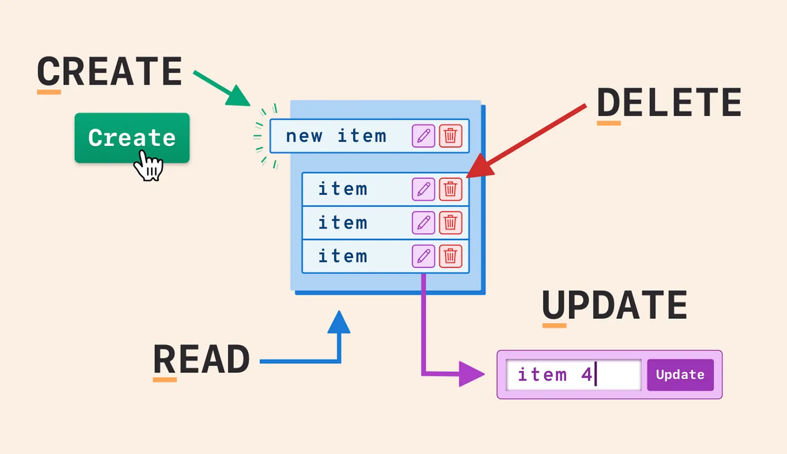
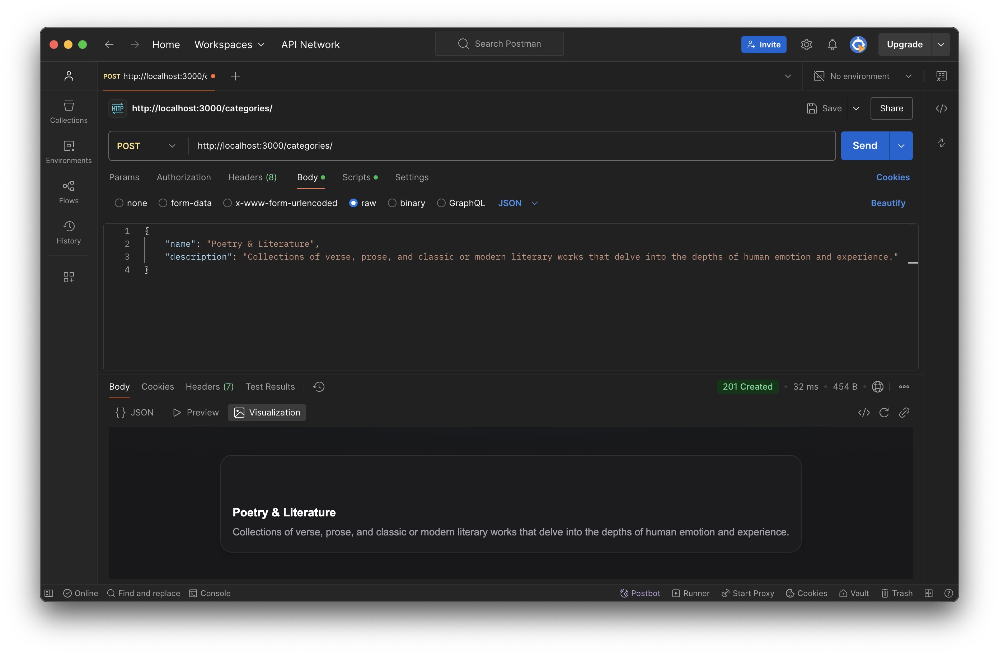
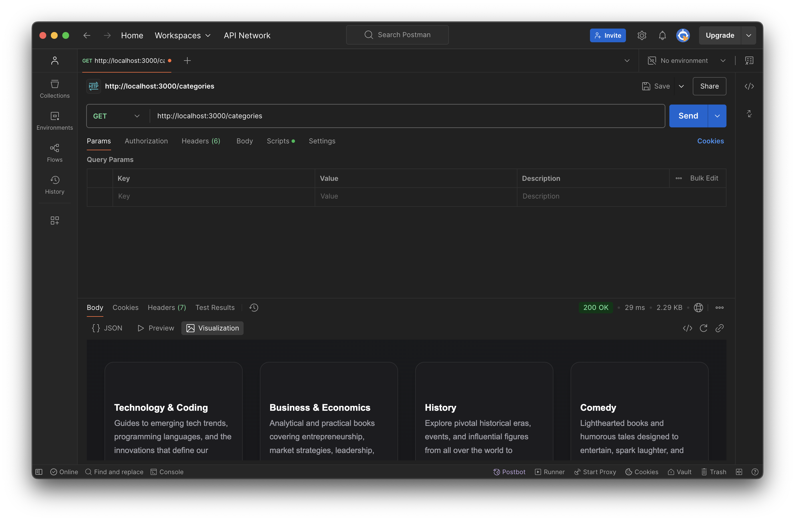
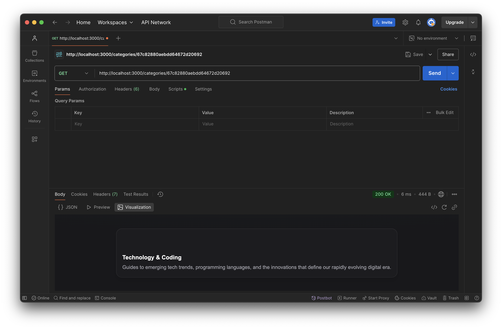
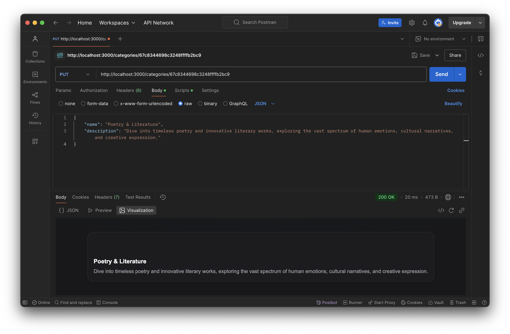
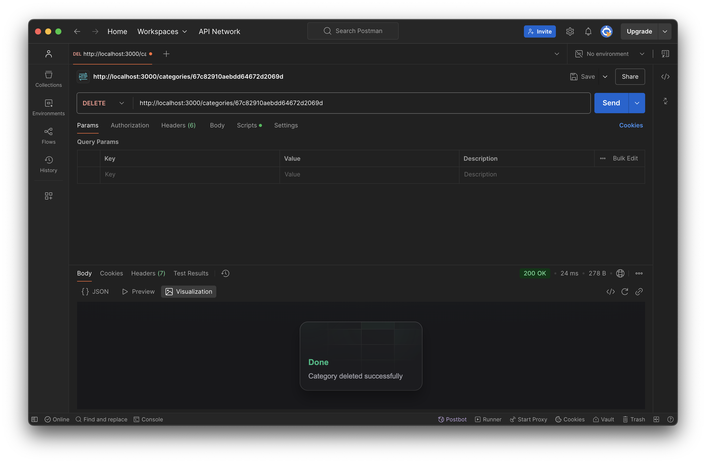

# Book Store API



A simple Node.js + Express + Mongoose project demonstrating full **CRUD** (Create, Read, Update, Delete) operations for book categories.  
This repository showcases how to set up a REST API, connect to MongoDB, validate requests (e.g., with Joi), and test endpoints in Postman.

---

## Project Structure

```bash
.
├── README.md                  # Project Documentation
├── database
│   └── database.js            # MongoDB connection logic
├── package-lock.json
├── package.json
├── routes
│   └── categories.routes.js   # Express routes for category CRUD
├── .env                       # Environment variables (ignored in .gitignore)
├── .gitignore                 # Lists files/folders to ignore (e.g. .env, node_modules)
├── server.js                  # Entry point for Express server
```

**Key Files:**

- **server.js**  
  Configures Express, imports routes, starts the server.
- **database/database.js**  
  Connects to MongoDB using Mongoose.
- **routes/categories.routes.js**  
  Defines the **CRUD** endpoints for categories.

---

## Overview

- **Description**: Manage book categories (add, list, view by ID, update, delete).  
- **Tech Stack**: Node.js, Express, Mongoose (MongoDB), (optionally) Joi for validation, Postman for testing.

---

## Setup and Installation

1. Clone the repository:

```bash
git clone https://github.com/Ahmed-A-Kandil/Book-Store-API.git
cd book-store-api
```

2. Install dependencies:

```bash
npm install
```

3. Configure environment:

- Create a .env file in the root folder (same level as server.js) with:

```txt
MONGODB_URI=mongodb://127.0.0.1:27017/test
PORT=3000
```

- (Optional) Add any other environment variables you need.
- Ensure .env is listed in .gitignore so it won’t be committed.

4 .Start MongoDB (if running locally):

```bash
brew services start mongodb-community@6.0
```

5. Run the Server:

```bash
npm run dev
```

or

```bash
node server.js
```

By default, the server listens on http://localhost:3000.

Endpoints

The CRUD operations for categories are exposed under the /categories path.

1. Create Category

- Method: POST /categories
- Headers: Content-Type: application/json
- Body Example:

```json
{
  "name": "Poetry & Literature",
  "description": "Collections of verse, prose, and classic or modern literary works that delve into the depths of human emotion and experience."
}
```



Success Response: 201 Created and the new category object.

2. Get All Categories

- Method: GET /categories
- Returns an array of category objects.



3. Get Category by ID

- Method: GET /categories/:id
- Success Response: 200 OK and the category object (or 404 Not Found).



4. Update Category

- Method: PUT /categories/:id
- Headers: Content-Type: application/json
- Body Example:

```json
{
  "name": "Poetry & Literature",
  "description": "Collections of verse, prose, and classic or modern literary works that delve into the depths of human emotion and experience."
}
```



Success Response: 200 OK and the updated object (or 404 Not Found).

5. Delete Category

- Method: DELETE /categories/:id
- Success Response: 200 OK

```json
{
  "message": "Category deleted successfully"
}
```



Contributing

1. Fork the repository.
2. Create a new branch for your feature (git checkout -b feature-name).
3. Commit your changes (git commit -m "Add feature").
4. Push to your fork (git push origin feature-name).
5. Open a pull request.

Happy Coding!
For questions or suggestions, open an issue or submit a pull request.
